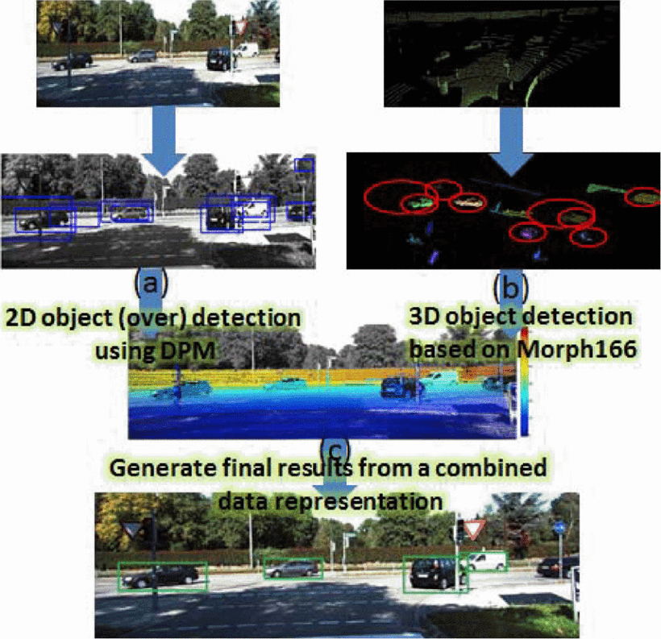
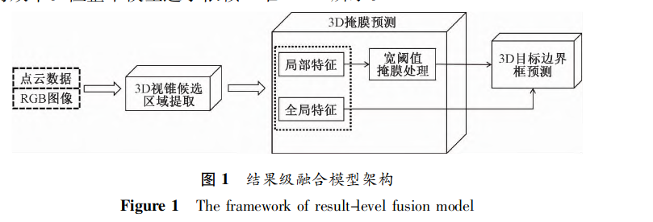
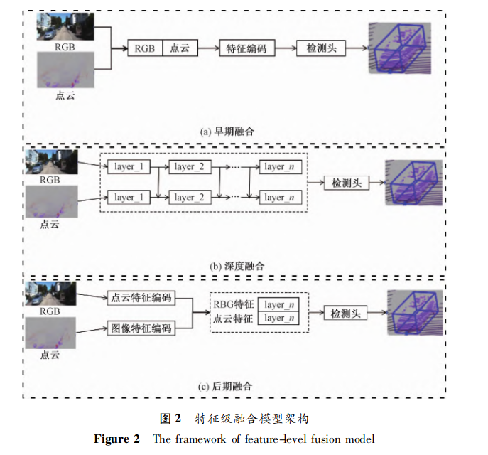
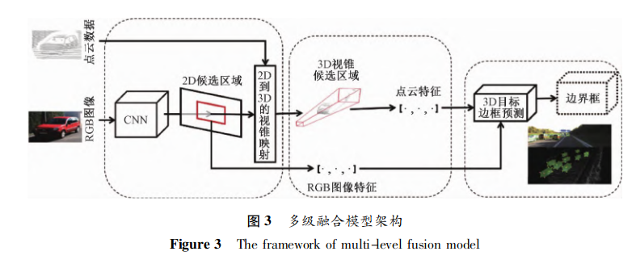
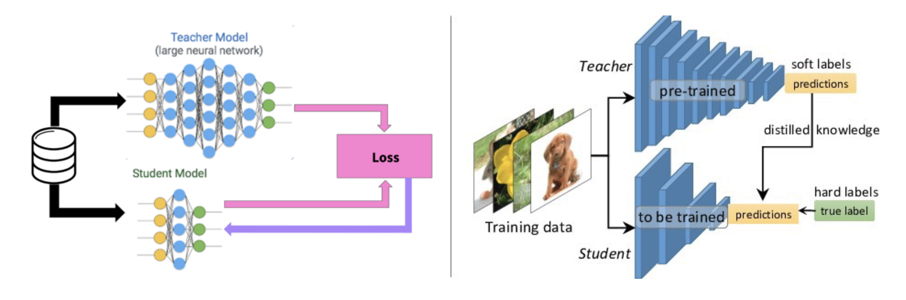
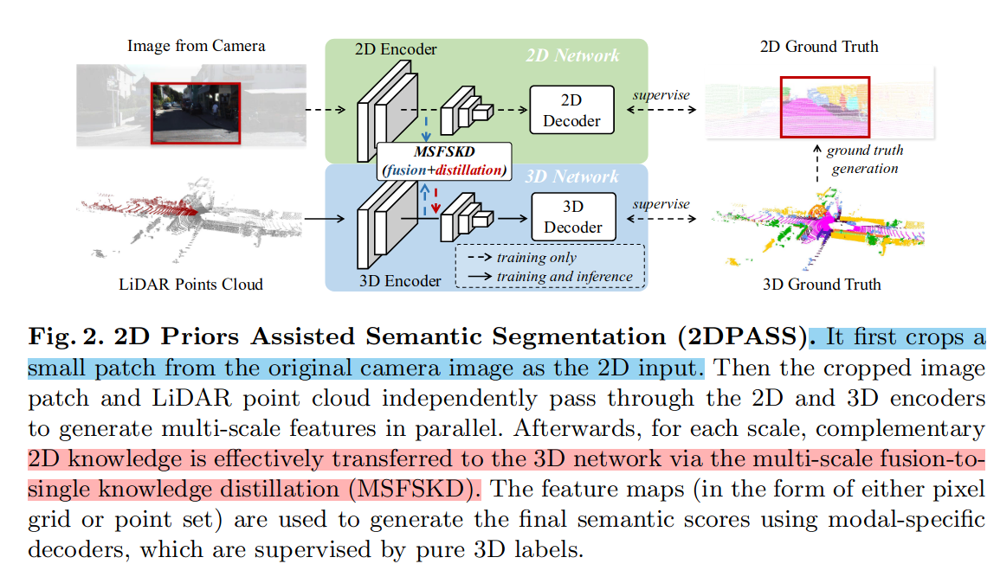
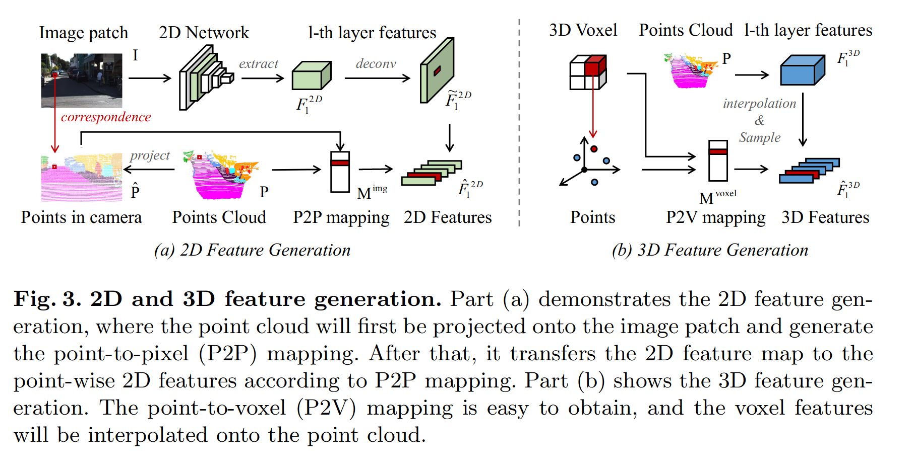
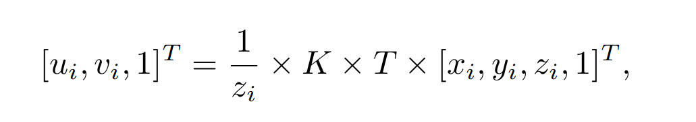
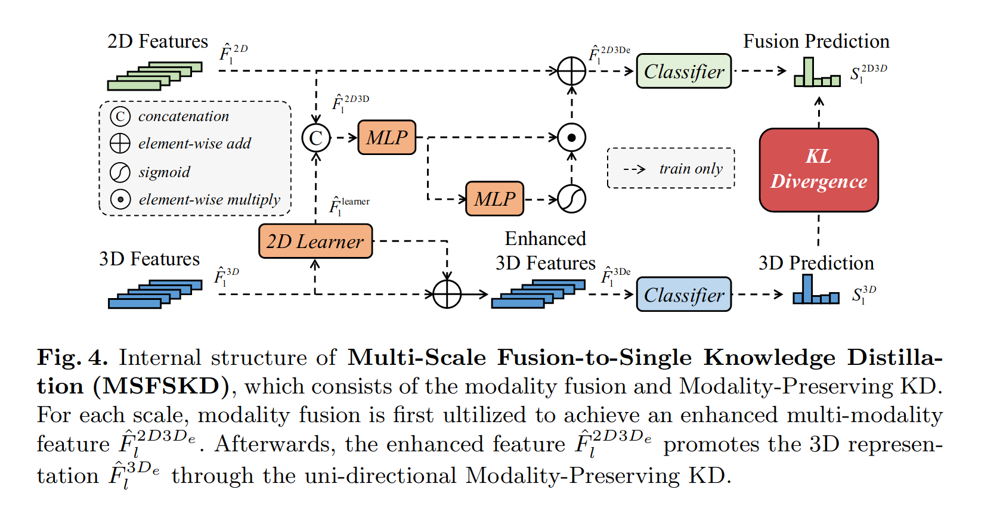

# 1 图像与点云融合

不同类型的传感器的优势互补可以为自动驾驶系统、空间位置获取提供准确、可靠的感知，基于视觉的系统可以利用低成本获得高性能的图像信息，点云数据可以真实表现物体表面真实的几何形状。

## 1.1 图像与点云融合的传统方法

多模态融合的传统方法一般包括代数法、卡尔曼滤波、贝叶斯理论等方法。

2014年，Xu等提出一种基于图像与点云数据融合增强的目标检测方法，在二维图像中获得候选目标区域的初始估计，同时以无监督的方式从相应的输入点云中提取包含潜在对象的三维点，只保留与预定义目标模型匹配的点。该方法对单个数据模态的检测是并行进行的，并且使用不同的融合方案进行组合。

传统方法可以实现图像和点云的融合，并且利用融合进行目标检测，但是传统方法在融合中不能充分利用多模态信息，目标检测的任务下精确度和速度不高

## 1.2 基于图像与殿云融合的目标检测

目前，三维目标检测方法可以分为两阶段目标检测和一阶段目标检测。 

两阶段目标检测模型包括提取候选框阶段和三维包围盒回归阶段，因此两阶段目标检测模型的性能受到多个阶段的限制。

一阶段目标检测模型只由一个阶段组成，其中二维和三维数据以并行方式处理。对于图像与点云融合的三维目标检测而言，可以将模型按照结果级融合、特征级融合和多级融合的方式进行分类。

### 1.2.1 结果级融合
结果级融合本质上是使用目前已经成熟的二维检测模型的结果来缩小三维目标检测的搜索空间， 即减少点云多余的背景点。这种方法可以有效减少计算量并提高运行效率。但整个模型过于依赖二维目标检测模型的结果，因此受到二维图像目标检测模型性能的限制

### 1.2.2 特征级融合

与结果级融合类似，一些多模态融合是在图像层面上进行的，其中三维几何体被转换为图像格式或作为图像的附加通道，即将三维几何体投影到图像平面上，并利用成熟的图像处理方法进行特征提取，结果输出也在图像上

根据特征级融合的网络分层以及融合时机，可以将特征级融合分为早期融合、深度融合和后期融合

#### 早期融合

传统的数据级融合是一种在每个数据层融合数据的方法，在原始数据级别进行空间对齐和投影，而早期融合是将激光雷达的原始数据与相机的原始数据相融合。

尽管不同模态的数据有不同的内在特征，但是大部分数据都是通过某种规则的方法处理生成的，因此早期融合比传统的数据级融合效果更好。

#### 深度融合
深度融合方法一般用于点云特征与图像特征的数据融合中。该方法使用特征提取器分别获取点云和相机图像的特征向量表示，并通过一系列模块将特征融合到两种模型中

#### 后期融合
后期融合是融合每个模态中通道输出结果的方法。一些后期融合方法利用点云通道和图像通道输出结果，并基于两种模式的结果进行最终预测。

在这种融合方式中，两种模态候选区的数据格式应与最终结果相同 但是格式不一定向相同

### 1.2.3 多级融合

多级融合是将结果级融合与特征级融合都加入模型中，更多地保留了图像的语义特征和点云的三维特征。

多级融合中典型的模型是PointFusion，该方法利用现有的二维目标检测生成二维包围框，将包围框投影到图像平面来选择相应的点，并定位通过包围框的点，再利用基于ＲesNet和PointNet的网络与图像结合起来，用于估计三维对象的点云特征。

## 1.3 基于图像与点云融合的语义分割

由于点云数据比较稀疏，难以提供精确的语义信息，在进行三维语义分割时，融合图像的语义信息可以使分割结果更加准确

按照模型的分割方式， 可以将模型分为基于多视图的语义分割、基于候选#框的语义分割和基于无候选框的语义分割。

### 1.3.1 基于多视图的语义分割

基于多视图的语义分割模型利用鸟瞰图、前视图等不同视角的ＲGB图像或经过处理的点云图像对目标物体进行语义分割。

### 1.3.2 基于候选框的语义分割
基于候选框的语义分割首先通过二维目标检测 模型提取二维候选框，再对三维场景中的物体进行分 割。

### 1.3.3 基于无候选框的语义分割

基于无候选框的语义分割是直接在三维数据上 进行分割任务，并在语义分割过程中加入图像的二维数据特征。

# 2 知识蒸馏 Knowledege Distillation
知识蒸馏（knowledge distillation）是模型压缩的一种常用的方法，不同于模型压缩中的剪枝和量化，知识蒸馏是通过构建一个轻量化的小模型，利用性能更好的大模型的监督信息，来训练这个小模型，以期达到更好的性能和精度。

最早是由Hinton在2015年首次提出并应用在分类任务上面，这个大模型我们称之为teacher（教师模型），小模型我们称之为Student（学生模型）。来自Teacher模型输出的监督信息称之为knowledge(知识)，而student学习迁移来自teacher的监督信息的过程称之为Distillation(蒸馏)。

首先有一个已经训练好的教师网络（Teacher model），把很多数据（input）喂给教师网络，教师网络会给每个数据都给一个温度为T的时候的softmax（文中soft labels）；同时把数据（input）喂给学生网络（student model），也给学生网络一个温度T获得softmax（文中soft predictions），对soft labels和soft predictions做一个损失函数L（distillation loss也叫soft loss），让他们两个越接近越好，解释就是学生在模拟老师的预测结果；学生网络经过一个T=1的普通的softmax（文中的hard prediction）和hard label再做一个损失函数（student loss也叫hard loss），让他们两个越接近越好。所以这个学生网络既要在温度为T的预测结果和教师网络的预测结果尽可能接近，又要在温度为1的预测结果和标准答案更可能接近。

# 3 DPASS：2D先验辅助的激光雷达点云语义分割

## 3.1 问题提出

尽管使用多模态数据能有效提升模型性能，但基于融合（fusion-based）的方法需要成对的数据（paired data）且存在以下局限性：

由于摄像机和激光雷达之间的视野（FOVs）不同，无法为图像平面外的点建立点到像素的映射。通常情况下，激光雷达和相机的FOVs仅在一小部分上有重叠（如上图所示，最右边图像上红色部分为 FOVs 重叠部分），这大大限制了基于融合的方法的应用

基于融合的方法在运行时同时处理图像和点云（通过多任务或级联方式），从而消耗了更多的计算资源，这给实时应用带来了很大负担

## 3.2 二维先验语义风格

论文提出了一种二维先验辅助语义分割（2DPASS）的通用训练方案，以提高在点云上的表示学习（representation learning）能力。论文提出的 2DPASS 在训练过程中充分利用了具有丰富语义信息的二维图像，然后在没有严格的成对数据约束情况下进行语义分割。在实际应用中，2DPASS 通过辅助模态融合（auxiliary modal fusion）和多尺度融合到单知识蒸馏（MSFSKD），从多模态数据中获取更丰富的语义和结构信息，然后将这些信息提取到纯 3D 网络。与基于融合的方法相比，论文的解决方案具有以下更好的特性：

通用性：可以在只修改少量的网络结构下轻松地与其他任何 3D 分割模型集成在一起

灵活性：融合模块仅在训练期间用于增强 3D 网络，训练后，增强的三维模型可以在没有图像输入的情况下部署

有效性：即使只有一小部分重叠的多模态数据，论文提出的方法也可以显著提高性能

实验结果显示，在装备了 2DPASS 之后，论文使用的基线模型（baseline model）在只有点云输入的情况下得到了显著的性能提升。具体来说，它在 SemanticKITTI 和 NuScenes 这两个大规模的公认基准上达到了SOTA。

## 3.3 网络结构

从原始图像中裁剪出一小块图像（480x320）作为 2D 输入（由于相机图像非常大，导致将原始图像发送到论文的多模态 pipeline 中是很难处理的），这个步骤加速了训练过程且没有多余的性能下降

裁剪后的图像和激光雷达点云分别通过 2D 和 3D 编码器，并行生成多尺度特征

对于每个尺度，互补的二维知识通过 MSFSKD 从而有效地转移到三维网络中（即充分利用纹理和颜色感知的二维先验知识，并保留原始的三维特定知识）

每个尺度上的 2D 和 3D 特征都被用于生成语义分割预测，这些预测由纯 3D 标签监督

在推理过程中，可以丢弃与 2D 相关的分支，与基于融合的方法相比，这有效地避免了实际应用中额外的计算负担。

2Dencoder和3Dencoder结构如上图所示，

（a）部分演示了2D特征生成，其中点云将首先投影到图像面片上，并生成点到像素（P2P）映射。然后，根据P2P映射将二维特征映射转换为逐点二维特征。

（b）部分显示了三维特征生成。点到体素（P2V）映射很容易获得，体素特征将插值到点云上。

点云在图像上的映射如下，其中K代表camera的内参，T代表外参：

### 编码器

二维卷积的RestNet34编码器作为2D网络， 使用稀疏卷积构建3D网络，具体来说设计了分层编码器SPVCNN， 激活韩寒时使用了LeakyReLU

### 解码器

利用FCN作为解码器对于每个编码层进行采样，所有采样的特征图通过元素相加进行河滨，最后融合特特征图通过现行分类器进行2D语义分割

对于3D 网络，用U-net作为解码器，不同尺度上的特征采样到原始大小，并且连接到一起

### MSFSKD

MSFSKD的内部结构包括模态融合和模态保持。其中2D特征和3D特征（通过2D Learner）进行融合，并通过两个MLP以及非线性映射对特征做点加，然后将输出特征和原2D特征进行融合，结合classifier，输出融合特征，3D部分则通过特征增强，结合classifier，输出3D预测结果，并在结果层面上做蒸馏

## 3.4 实验结果

KITTI数据集，语义分割结果，相同速度下，2DPASS大幅度超越PolarNet，相近性能下，2DPASS速度相比RPVNet和S3Net提升明显；